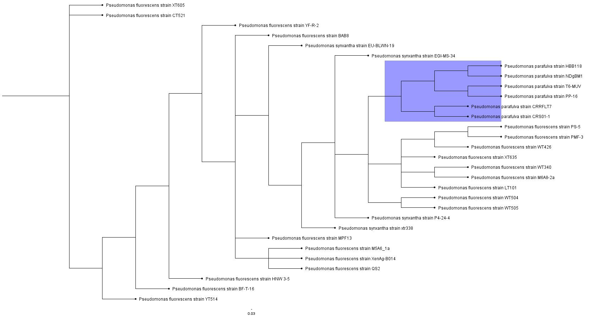

# **Phylogenetic Analysis of Pseudomonas Bacterial Genera and the S16 gene**
Aharon Heinemann
<p>5/4/2025 - 6 Iyyar 5785

## Abstract

Phylogenetic analysis and the building of a software pipeline is a powerful tool in identifying species and genera of all living organisms.
In particular, it can be leveraged to build a model of understanding bacterial relationships and used to determine avenues for classifying unkown cultures.
By creating a software pipeline that aligns genetic sequences taken from the *Pseudomonas* genus and the 16S gene, we can visualize the effect Horizontal Gene Transfer has on Bacterial phylogenetics.
<p>
With the created pipeline, we were able to show the effect on HGT has within *Pseudomonas* and finding with an extreme level of confidence that we can use the pipeline to determine lineage via the 16S gene.
Using 30 randomly selected *Pseudomonas* bacteria we managed to create a tree with an average standard deviation of <0.01 between split frequencies.

## Introduction

The primary goal of this project is to make a basic phylogenetic pipeline that can be used to classify *Pseudomonas* genus bacteria. In particular we are looking at *P. fluorenscens* and the 16s gene. 
The 16s gene is the gold standard when it comes to bacterial phylogenetics due to being highly conserved, thus being consistant across differnet species.
Prior labratory experience has shown that it is impossible to accuratly determine bacterial genus or species by hand. 16S analysis is the only method that has had consistant success at placing sample cultures to a genus or species.
There is a problem of the "bacterial superorganism" [5], or rather a limit to the accuracy of genetic analysis of bacteria due to Horizontal Gene Transfer (HGT) [6].
Most traditional methods of phylogenetics rely on the assumption that genetic variablity is done via Parent-to-Child or Vertical Gene Transfer, and provides a way to "limit" how mutations arise in a population.
Bacteria can instead swap genetic information in plasmids, allowing for new subspecies variations within a close group.
For example, within the Genus *Pseudomonas* exists 25 known species groups, and 11 major subgroups [8]. These groups contain multiple known subspecies that range from oppurtunistic pathogens, symbiotic nitrogen fixers, and antibacterial or antifungal agent producers [7][9][11][13].

<p>

By making this phylogenetic pipeline we hope to demonstrate a method to classify *Pseudomonas* bacteria within the *putida* subgroup, while filtering out other species. 
As well as demonstrate the bacterial superorganism theory through phylogentic analysis.

## Methods

Data was retrieved from the NCBI database on the Pseudomonas S16 Gene. 30 random samples were taken with 20 of them being from *Pseudomonas fluorenscens*, 4 from *P. synxantha*, and 6 from *P. parafulva*.
P. fluorenscens and P. synxantha are within the same bacterial subgroup, while *P. parafulva* [12] is not. Each of the species are known to produce antimicrobial compounds in nature [7][9][11].
<p>
ClustalX [1] was used for alignment. The data was saved in Clustal, Nexus, and Phylip formats for later use. ClustalX has the same methods as its predecessor, ClustalW, however it is built around a UX interface and much easier to navigate
Generally there aren't any real limitations found with Clustal. There may be some minor differences in speed and accuracy compared to MUSCLE, but in our case it was negligable.
There was the main assumption that we would be using multiple alignment, rather than profile. As well as exporting the data in multiple formats due to other programs limitations.
<p>
Iq-Tree [3] was used for maximum likelihood analysis. We chose this due to being built for Windows and for gaining a rough approximation of what the tree should look like according to a maximum likelihood method. 
However maximum likelihood is not as accurate as baysean analysis with the Markov Chain. 
<p>
MrBayes [2] was used for final Baysean analysis. Similarly to Iq-Tree, we chose MrBayes due to software limitations with Windows. It is the main component of our analysis because of its accuracy.
There is the limitation of time, but due to our fairly limited data set we were able to work around it. We ran MB for 1,500,000 generations, sampling every 5 and a diagonal of 50.
We set the Burn at 0.20 and stop value at 0.01. This was based on prior trial runs with a related rpsP S16 sequence. 
<p>
FigTree [4] was used to then visualize the MrBayes tree readout. The program uses the .tre file produced by MrBayes, so its visualization is highly dependant on the MCMC settings.

## Results

```
                                        95% HPD Interval
                                       --------------------
   Parameter      Mean      Variance     Lower       Upper       Median    min ESS*  avg ESS    PSRF+
   --------------------------------------------------------------------------------------------------
   TL          0.714282    0.004965    0.579476    0.853255    0.710395   5089.59   5434.61    1.000
   r(A<->C)    0.105851    0.000347    0.069959    0.142747    0.105113   1826.97   1995.86    1.000
   r(A<->G)    0.200932    0.000491    0.158264    0.244417    0.200148   1481.01   1889.55    1.000
   r(A<->T)    0.157603    0.000465    0.117004    0.200091    0.156963   2366.86   2480.08    1.000
   r(C<->G)    0.126712    0.000346    0.091526    0.163388    0.126249   2293.11   2337.55    1.001
   r(C<->T)    0.254841    0.000773    0.202937    0.310941    0.254200   1522.56   1755.00    1.000
   r(G<->T)    0.154061    0.000399    0.116372    0.193919    0.153206   2675.93   2739.17    1.000
   pi(A)       0.254649    0.000107    0.235307    0.275645    0.254634   2779.47   3105.61    1.000
   pi(C)       0.222102    0.000100    0.202837    0.242133    0.221884   2548.38   2767.82    1.000
   pi(G)       0.307584    0.000120    0.285572    0.328603    0.307621   2801.64   3008.64    1.000
   pi(T)       0.215665    0.000093    0.197275    0.234762    0.215543   2598.92   3026.19    1.000
   alpha       0.394140    0.005952    0.263504    0.553382    0.382889   2275.50   2423.15    1.000
   pinvar      0.671395    0.001132    0.604991    0.735583    0.672615   2256.78   2483.66    1.000
   --------------------------------------------------------------------------------------------------
   * Convergence diagnostic (ESS = Estimated Sample Size); min and avg values
     correspond to minimal and average ESS among runs.
     ESS value below 100 may indicate that the parameter is undersampled.
   + Convergence diagnostic (PSRF = Potential Scale Reduction Factor; Gelman
     and Rubin, 1992) should approach 1.0 as runs converge.

 Summary statistics for partitions with frequency >= 0.10 in at least one run:
       Average standard deviation of split frequencies = 0.006764
       Maximum standard deviation of split frequencies = 0.019610
       Average PSRF for parameter values (excluding NA and >10.0) = 1.000
       Maximum PSRF for parameter values = 1.004


```
Fig 1. Highest Posterior Density Interval for *Pseudomonas* 16s Gene. The PSRF shows that the chains of the model converged and the average ESS of the parameters show that the sample sizes were appropriate.
The average standard deviation of the HPD is 0.006764. The maximum standard deviation was 0.019. The average PSRF was 1.0 and the maximum PSRF was 1.004.
 
Fig. 2 *Pseudomonas* 16s Gene Tree. Isolated *parafulva* clade highlighted in purple.

Because the average standard deviation of split frequencies is **σ << 0.1**, we can determine that there is a low level of divergence between samples.
This means that the model was stable in converging and that we can generally assume that there is strong evidence for the overall phylogenetic relationship between the samples.
We can also determine that the data was not undersampled based on all of the parameters converging on a PSRF of 1.0. 
There is a risk of the data being oversampled, however a quality check was performed and the analysis showed a similar convergance even at a much lower generation count and sample frequency.
 
## Discussion

Based on the visualization, we can see an example of the bacterial superorganism theory as the *fluorenscens* group are dispersed amongst each other throughout the tree. 
But the *parafulva* group is self-contained in its own clade as would be expected of a different species.
This means that there is support for applying the designed pipeline for it's intended purpose.
Because the model shows some level of segregation between the groups of species, we can work around the HGT problem.
Or alternativly, use it to place undetermined bacteria in these groups.
We can also fairly confidently say that despite this segregation, there is a common ancestor between *parafulva* and *fluorenscens*.
Along with determining that *parafulva* is still closely related to the other group. 
<p>
One problem that the pipeline has in its current state is the limitation of time.
The final MCMC analysis took several hours and means that larger datasets would be unfeasable with the current settings.
The main way to fix this is to drastically increase the sample rate, somewhere around the 200-500 range.
However this does not discount the overall result, as the trees are biologically reasonable.
Overall the pipeline works and demonstrates that bacteria are able to be classified phylogenetically using the same methods as other organisms.
However care should be taken to identify  any Horizonal Gene Transfer or whether the target bacteria have a tendency to form a shared group, rather than discrete individual species.

## References

[1] Julie D. Thompson, Toby J. Gibson, Frédéric Plewniak, François Jeanmougin, Desmond G. Higgins, The CLUSTAL_X Windows Interface: Flexible Strategies for Multiple Sequence Alignment Aided by Quality Analysis Tools, Nucleic Acids Research, Volume 25, Issue 24, 1 December 1997, Pages 4876–4882, https://doi.org/10.1093/nar/25.24.4876

[2] Fredrik Ronquist, Maxim Teslenko, Paul van der Mark, Daniel L. Ayres, Aaron Darling, Sebastian Höhna, Bret Larget, Liang Liu, Marc A. Suchard, John P. Huelsenbeck, MrBayes 3.2: Efficient Bayesian Phylogenetic Inference and Model Choice Across a Large Model Space, Systematic Biology, Volume 61, Issue 3, May 2012, Pages 539–542, https://doi.org/10.1093/sysbio/sys029

[3] Lam-Tung Nguyen, Heiko A. Schmidt, Arndt von Haeseler, Bui Quang Minh, IQ-TREE: A Fast and Effective Stochastic Algorithm for Estimating Maximum-Likelihood Phylogenies, Molecular Biology and Evolution, Volume 32, Issue 1, January 2015, Pages 268–274, https://doi.org/10.1093/molbev/msu300

[4] https://tree.bio.ed.ac.uk/software/figtree/ FigTree viewer

[5] Ochman H, Lawrence JG, Groisman EA. Lateral gene transfer and the nature of bacterial innovation. Nature. 2000 May 18;405(6784):299-304. doi: 10.1038/35012500. PMID: 10830951.

[6] Carrillo-Ávila, J. A., Aguilar-Quesada, R., Ligero, G., Panadero-Fajardo, S., Santos-Pírez, M. V., & Catalina, P. (2023). Identification of cell culture contamination by an unusual species of Mycoplasma related to the M. mycoides cluster. Cytotechnology, 75(2), 135–141. https://doi.org/10.1007/s10616-022-00567-7

[7] Wechter WP, Begum D, Presting G, Kim JJ, Wing RA, Kluepfel DA. (2002) Physical mapping, BAC-end sequence analysis, and marker tagging of the soilborne nematicidal bacterium, Pseudomonas synxantha BG33R. OMICS 6: 11-21

[8] Anzai; Kim, H; Park, JY; Wakabayashi, H; Oyaizu, H; et al. (Jul 2000). "Phylogenetic affiliation of the pseudomonads based on 16S rRNA sequence". Int J Syst Evol Microbiol. 50 (4): 1563–89. doi:10.1099/00207713-50-4-1563. PMID 10939664

[9] Nikolaidis, Marios; Mossialos, Dimitris; Oliver, Stephen G.; Amoutzias, Grigorios D. (2020-07-24). "Comparative Analysis of the Core Proteomes among the Pseudomonas Major Evolutionary Groups Reveals Species-Specific Adaptations for Pseudomonas aeruginosa and Pseudomonas chlororaphis". Diversity. 12 (8): 289. Bibcode:2020Diver..12..289N. doi:10.3390/d12080289. ISSN 1424-2818

[10] Mulet, Magdalena; Lalucat, Jorge; García-Valdés, Elena (March 2010). "DNA sequence-based analysis of the Pseudomonas species". Environmental Microbiology. 12 (6): 1513–1530. Bibcode:2010EnvMi..12.1513M. doi:10.1111/j.1462-2920.2010.02181.x. PMID 20192968

[11] Poli, Noémie; Keel, Christoph Joseph; Garrido-Sanz, Daniel (2024-07-15). "Expanding the Pseudomonas diversity of the wheat rhizosphere: four novel species antagonizing fungal phytopathogens and with plant-beneficial properties". Frontiers in Microbiology. 15. doi:10.3389/fmicb.2024.1440341. ISSN 1664-302X. PMC 11284033. PMID 39077740.

[12] Uchino; Shida, O; Uchimura, T; Komagata, K; et al. (Oct 2001). "Recharacterization of Pseudomonas fulva Iizuka and Komagata 1963, and proposals of Pseudomonas parafulva sp. nov. and Pseudomonas cremoricolorata sp. nov". J Gen Appl Microbiol. 47 (5): 247–261. doi:10.2323/jgam.47.247. PMID 12483612

[13] Abanda-Nkpwatt; Krimm, Ursula; Schreiber, Lukas; Schwab, Wilfried; et al. (2006). "Dual Antagonism of Aldehydes and Epiphytic Bacteria from Strawberry Leaf Surfaces against the Pathogenic Fungus Botrytis cinerea in vitro". BioControl. 51 (3): 279–291. doi:10.1007/s10526-005-4362-3. S2CID 26737900